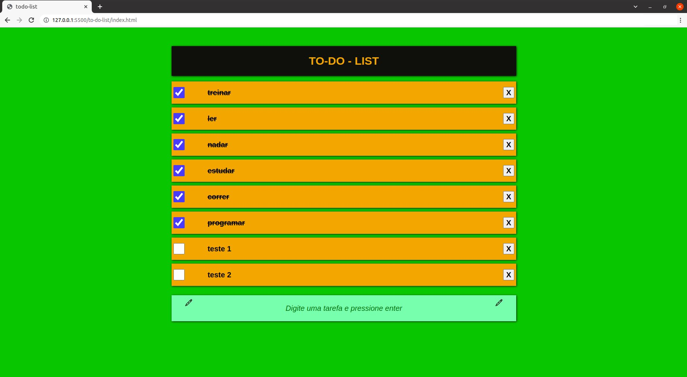

# **To-do-list - projeto simples**

Treino de conceitos básicos no JavaSCript, por meio de pequenas funções em JavaScrip puro. 
O layout foi montado usando HTML e CSS.

Resumidamente, a aplicação permite manipular uma lista de tarefas, bem como, inserir, atualizar marcar/"dar check nas tarefas" e deletar.

#### **To-Do List no navegador**

